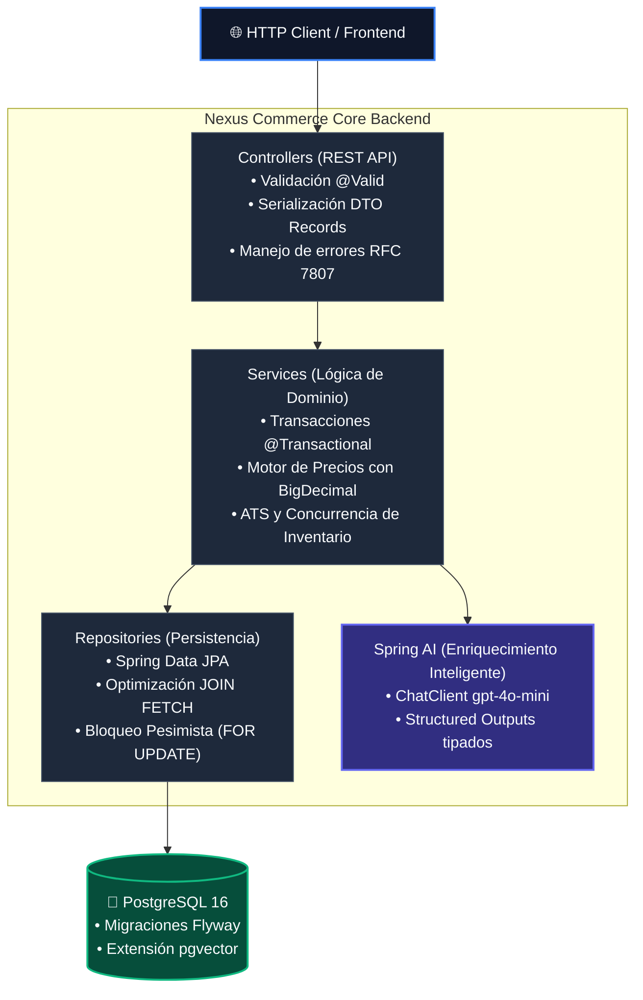

# Nexus Commerce Core

Backend transaccional de alto rendimiento para retail global, diseñado bajo estándares de ingeniería de producción inspirados en plataformas de comercio electrónico de escala masiva.


---

## 1. Arquitectura y Principios de Diseño

El sistema aplica separación estricta de responsabilidades (*Separation of Concerns*) y desacoplamiento de capas:



### Directrices Técnicas Obligatorias
* **Inmutabilidad y DTOs:** Las entidades JPA nunca se exponen al exterior. La comunicación con clientes HTTP se realiza mediante Java `Record` inmutables.
* **Aritmética Financiera:** Tolerancia cero con errores de coma flotante. Todos los cálculos de precios, divisas e impuestos utilizan estrictamente `BigDecimal` con redondeo `RoundingMode.HALF_UP`.
* **Concurrencia de Inventario:** Prevención de *over-selling* mediante bloqueo pesimista en base de datos (`SELECT ... FOR UPDATE` vía `@Lock(LockModeType.PESSIMISTIC_WRITE)`).
* **Manejo de Errores Semántico:** Excepciones de dominio traducidas centralizadamente por `GlobalExceptionHandler` bajo el estándar de errores estructurados (HTTP 400, 404, 409 Conflict).
* **Taxonomía Automatizada:** Integración de **Spring AI** para enriquecer descripciones textiles no estructuradas mediante *Structured Outputs* (JSON Schema estricto).
* **Trazabilidad de Decisiones:** Los fundamentos técnicos y compromisos arquitectónicos están documentados en [docs/adr](docs/adr/README.md).

### Imágenes de Producto (Frontend)

Las imágenes **no viven en la base de datos**: son ficheros estáticos bajo `frontend/public/products/`, servidos por la canalización de `next/image`. El backend no tiene migración, campo, DTO ni endpoint para ellas.

| Regla | Detalle |
|:---|:---|
| **Ruta** | `public/products/{referencia}-{n}.webp`, con la `/` de la referencia sustituida por `-` → `0432/021` = `0432-021-1.webp` … `-3.webp` |
| **Manifiesto** | `frontend/src/data/product-images.json`, generado por el script y **importado estáticamente** desde `src/lib/product-images.ts` — sin `fetch` en tiempo de ejecución |
| **Generación** | `cd frontend && npm run images`: descubre las referencias **de las migraciones**, genera los WebP 1200×1600 con `sharp` y reescribe el manifiesto. **Idempotente** |
| **Componente** | `ProductImage` (contenedor `aspect-[3/4]` + `<Image fill sizes>`). Sin entrada en el manifiesto o fallo de carga (`onError`) → caja `ProductThumb`: cero 404 |
| **`sizes`** | **Obligatorio** en cada uso y derivado del ancho real de la caja; si falta, el navegador asume `100vw` y descarga de más. Las constantes viven en `ProductCard` y `ProductGallery` |
| **LCP** | La primera fila va `loading="eager"` + `fetchPriority="high"`. **Nunca `priority`**: deprecado desde Next 16 |

Para añadir una imagen nueva: coloca el fichero en `public/products/`, ejecuta `npm run images` para refrescar el manifiesto y refiérelo desde `ProductImage`. No hay ningún cambio de backend.

---

## 2. Motores Implementados

| Módulo | Responsabilidad de Negocio | Enfoque Técnico |
| :--- | :--- | :--- |
| **Catalog Engine** | Gestión jerárquica de Producto y variantes físicas (SKU). | Carga sin problema N+1 (`@EntityGraph`), consultas JPQL optimizadas. |
| **Pricing Engine** | Precios multidivisa por mercado con desglose impositivo. | Modelado desacoplado por mercado (`MarketPrice`), cálculo dinámico de base neta e IVA. |
| **Inventory Engine** | Visión omnicanal de existencias y control de reservas atómicas. | Cálculo ATS (*Available to Sell*), bloqueo pesimista contra condiciones de carrera. |
| **AI Enrichment** | Extracción automática de taxonomía, ocasión y tags de búsqueda. | Spring AI `ChatClient` con `gpt-4o-mini`, deserialización a record tipado. |
| **Order & Checkout Engine** | Orquestación transaccional de compra e idempotencia. | Clave de idempotencia única, snapshot financiero inmutable y rollback ante falta de stock. |

---

## 3. Catálogo de APIs REST

> Los endpoints marcados con 🔒 requieren cabecera `Authorization: Bearer {access token}`.

### Autenticación y Sesión
* `POST /api/v1/auth/register` $\rightarrow$ Crea la cuenta y envía un código de verificación de 6 dígitos al email (`200` sin cuerpo). La contraseña se almacena con BCrypt.
* `POST /api/v1/auth/verify-email?email={email}&code={code}` $\rightarrow$ Verifica el email. **Obligatorio antes del login.** El código caduca en 15 minutos.
* `POST /api/v1/auth/resend-verification?email={email}` $\rightarrow$ Reenvía el código de verificación.
* `POST /api/v1/auth/login` $\rightarrow$ Devuelve `AuthResponse` (access token de 24 h + refresh token de 7 d). Devuelve `401` si las credenciales son inválidas o el email no está verificado.
* `POST /api/v1/auth/forgot-password?email={email}` $\rightarrow$ Envía un código de recuperación por email.
* `POST /api/v1/auth/reset-password?email={email}&code={code}&newPassword={password}` $\rightarrow$ Restablece la contraseña con el código de recuperación.
* `POST /api/v1/auth/refresh?refreshToken={token}` $\rightarrow$ Emite un nuevo access token a partir del refresh token.
* 🔒 `GET /api/v1/auth/me` $\rightarrow$ Devuelve el perfil del usuario asociado al token (`401` sin token).

### Catálogo de Productos
* `GET /api/v1/products/families` $\rightarrow$ Taxonomía real del catálogo: `[{ family, productCount }]` ordenada por familia. **Público** (sin sesión) y calculada en BD con `SELECT family, COUNT(*)`, contando **productos y no SKUs**. Es la única fuente del menú de familias: la portada y la columna de filtros se pintan de esta respuesta, nunca de un `Set` derivado de la lista de productos.
* `GET /api/v1/products?family={familia}&size={talla}&color={color}&sort={orden}` $\rightarrow$ Lista de productos filtrada **en backend** y combinada con **AND**. `family` exige que el producto pertenezca a esa familia; `size` y `color` exigen que coincidan **en el mismo SKU**, de modo que `?size=M&color=Negro` no sirve para mezclar variantes de prendas distintas. `sort` admite `default` \| `name-asc` \| `name-desc` (cualquier otro valor → `400` con los valores admitidos); una familia inexistente → `200 []`. **Sin paginación**: la respuesta siempre llega entera.
* `GET /api/v1/products/search?reference={ref}` $\rightarrow$ Búsqueda exacta por código comercial (ej: `0432/021`).
* `POST /api/v1/products/enrich?reference={ref}` $\rightarrow$ Clasificación y enriquecimiento taxonómico mediante LLM.

### Mercados y Precios Multimercado
* `GET /api/v1/markets` $\rightarrow$ Lista los mercados activos con su divisa y tipo impositivo (`code`, `name`, `currency`, `taxRate`), ordenados por código. **Público** (sin sesión) y sin lógica de negocio: solo `findAll` + mapeo a `MarketResponse`. Es la única fuente de la lista del selector de mercado del frontend.
* `GET /api/v1/pricing/skus/{skuId}?market={code}` $\rightarrow$ Devuelve desglose financiero (base neta, impuestos, moneda y descuento) **del mercado indicado**. Devuelve `404` si ese mercado no tiene precio para el SKU, estado que la ficha de producto traduce a «No disponible en …».

### Inventario y Stock
* `GET /api/v1/inventory/skus/{skuId}` $\rightarrow$ Consulta agregada del stock omnicanal y desglose por almacén.
* `POST /api/v1/inventory/reserve` $\rightarrow$ Reserva atómica de existencias. Devuelve `409 Conflict` si el ATS es insuficiente.

### Búsqueda y Enriquecimiento
* `GET /api/v1/products/search/semantic?query={q}&family={f}&limit={n}` $\rightarrow$ Búsqueda por similitud semántica mediante embeddings vectoriales (HNSW). El filtro `family` se inyecta en la expresión de filtro **sólo** si la familia existe en el catálogo (`existsByFamily`) y no contiene comillas; si no, la búsqueda **devuelve `200 []` sin consultar el vector store**. No admite filtro por precio.
* `POST /api/v1/products/search/index` $\rightarrow$ Dispara la reindexación vectorial completa del catálogo.

### Pedidos y Checkout
* 🔒 `POST /api/v1/orders/checkout` $\rightarrow$ Procesa la compra. Requiere cabecera `Idempotency-Key` (UUID) y los campos `addressId` y `paymentMethod` (`CARD` | `BIZUM` | `PAYPAL` | `BANK_TRANSFER`). Reserva existencias, congela precios y genera la orden (`201 Created`). La dirección indicada se copia a la orden como **snapshot inmutable**: editarla después no cambia el pedido.
* 🔒 `GET /api/v1/orders/{orderNumber}` $\rightarrow$ Recupera el detalle completo de un pedido, con `shippingAddress`, `paymentMethod` y `returnDeadline` (fecha límite de devolución, calculada en servidor desde los 30 días de la ventana).

> El **método de pago es un dato declarado, no un cobro**: no se pide número de tarjeta, no se tokeniza y no se conecta con ninguna pasarela — el proyecto no tiene PSP, igual que `refundAmount` es solo un registro contable.

### Historial de Pedidos y Devoluciones

* 🔒 `GET /api/v1/users/me/orders?page={n}&size={n}` $\rightarrow$ Historial paginado del usuario, del más reciente al más antiguo (`OrderPageResponse`). Cada fila trae sus líneas (`items`) con nombre y variante del producto, más `returnRequested` para pintar el badge «Devolución solicitada». Ese badge se resuelve con **una única consulta por página**, no una por línea.
* 🔒 `GET /api/v1/users/me/orders/{orderNumber}` $\rightarrow$ Detalle de un pedido propiedad del usuario. Un pedido de otro usuario responde `404` (nunca `403`, para no filtrar su existencia).
* 🔒 `POST /api/v1/users/me/orders/{orderNumber}/returns` $\rightarrow$ Body `{ "orderItemId": n, "reason": "…" }`. Valida los 30 días desde la compra, el estado `DELIVERED` y la ausencia de devoluciones previas **antes** de persistir; si la línea no es elegible responde `409 Conflict` con `code: RETURN_NOT_ALLOWED`. Devuelve `201 Created` con `ReturnResponse`.
* 🔒 `GET /api/v1/users/me/orders/{orderNumber}/returns` $\rightarrow$ Devoluciones de un pedido propiedad del usuario.

> Cada línea del detalle de pedido enriquece su respuesta con `returnEligible` y `returnIneligibleReason` (`NOT_DELIVERED` | `EXPIRED` | `ALREADY_RETURNED`), de modo que la UI puede explicar **por qué** una línea no admite devolución. `refundAmount` es un **registro contable**: no hay pasarela de pago y no se mueve dinero.

### Perfil y Direcciones
* 🔒 `GET /api/v1/users/me` $\rightarrow$ Devuelve el perfil completo, incluidas las medidas (`height`, `weight`) usadas para recomendar tallas.
* 🔒 `PUT /api/v1/users/me` $\rightarrow$ Actualiza el perfil. Es una **actualización parcial**: los campos `null` conservan su valor. El **email no es modificable**. Valida altura (100–250 cm), peso (30–250 kg) y fecha de nacimiento (no futura, no anterior a 1900).
* 🔒 `GET /api/v1/users/me/addresses` $\rightarrow$ Lista las direcciones del usuario, la principal primero. Máximo **2** direcciones.
* 🔒 `POST /api/v1/users/me/addresses` $\rightarrow$ Añade una dirección (`201` con `Location`). La primera nace como principal; la tercera responde `400` con mensaje explicativo.
* 🔒 `PUT /api/v1/users/me/addresses/{id}` $\rightarrow$ Actualiza una dirección. Si se marca como principal, se desmarca automáticamente la anterior. Responde `404` si la dirección no pertenece al usuario (nunca `403`, para no filtrar su existencia).
* 🔒 `DELETE /api/v1/users/me/addresses/{id}` $\rightarrow$ Elimina la dirección (`204`). Si era la principal, la restante se promueve automáticamente.
* 🔒 `POST /api/v1/users/me/size-recommendation` $\rightarrow$ Body `{ "productId": n }`. Devuelve `{ recommendedSize, reason, confidence }` a partir de las medidas del perfil y las tallas disponibles del producto. `confidence` es `Alta`, `Media` o `Baja` según la fiabilidad de la tabla de referencia. Devuelve `400` si el usuario no tiene medidas guardadas.

### Documentación Interactiva y Contratos (OpenAPI 3 / Swagger)
* **Swagger UI:** `http://localhost:8080/swagger-ui.html` (consola de ejecución y pruebas de endpoints).
* **OpenAPI Spec:** `http://localhost:8080/v3/api-docs` (contrato JSON para generación de clientes tipados).

---

## 4. Puesta en Marcha Local

### Prerrequisitos
* Java 21 LTS (ej: Amazon Corretto / Eclipse Temurin)
* Docker Desktop u OrbStack
* Puerto `5432` y `8080` disponibles

### 1. Iniciar Base de Datos
```bash
docker compose up -d
```

### 2. Ejecutar la Suite de Pruebas (>90% Cobertura)
```bash
cd backend
./mvnw clean test
```

### 2b. Frontend: tests y cobertura
```bash
cd frontend
npx vitest run          # suite sin cobertura (lo que usa el watch)
npm run test:coverage   # suite + informe + comprobación de umbrales
```

`npm run test:coverage` **no sólo informa, también protege**: aplica los umbrales
congelados de `frontend/vitest.config.ts` y sale con código distinto de `0` si
falla un test **o** si la cobertura baja del piso (77 % de sentencias, 76 % de
ramas, 74 % de funciones y 79 % de líneas — medida real de la Tarea 4.1, no un
objetivo impuesto). El informe queda en `frontend/coverage/` (`text` en consola,
`html` navegable y `lcov`), y CI lo sube siempre como artefacto
`coverage-report`, aunque el job falle.

Los dos comandos son independientes: `npx vitest run` **no** evalúa umbrales,
así que si quieres el check de cobertura hay que pasar por `test:coverage`.

### 2c. Frontend: tests end-to-end (Playwright)

A diferencia de los unitarios, los E2E **necesitan el stack entero levantado**:
hablan con Spring de verdad, no con la API mockeada.

```bash
docker compose up -d                      # PostgreSQL
cd backend && ./mvnw spring-boot:run      # API en :8080
cd frontend
npx playwright install                    # una vez: descarga los navegadores

npm run test:e2e          # los 3 navegadores (Chromium, Firefox, WebKit)
npm run test:e2e:quick    # sólo Chromium — iteración local rápida
```

Antes de la primera prueba, `e2e/global-setup.ts` deja el entorno listo y lo
hace de forma **idempotente** (dos corridas seguidas pasan igual):

1. Espera a que el backend responda en `GET /api/v1/markets` (hasta 120 s). Ese
   endpoint sirve de *readiness* porque además no responde hasta que **Flyway
   ha terminado de migrar** — el backend no tiene Actuator.
2. Crea `e2e@nexus.dev` **verificado** por la API real: registra, lee el
   `verification_code` de la tabla `users` y lo confirma en `/verify-email`.
   **No hay SMTP** y **no existe ninguna migración de semilla**.
3. Le da una dirección por defecto — el checkout exige `addressId`, y el
   carrito la precoselecciona.
4. Restaura el stock del SKU que se compra a sus valores de la semilla
   (`843321900101`: 150/5 en `WH_ARTEIXO`, 80/0 en `WH_ZARAGOZA`). Sin esto,
   cada compra descuenta y la serie se agotaría con el tiempo.

Las credenciales de Postgres salen de las variables `PG*` (por defecto las de
`application.properties`); en CI se sustituyen por las del servicio. El backend
se habla directamente en `localhost:8080`, no a través del rewrite de Next.

> **Firefox en macOS**: la build de Firefox que empaqueta Playwright no
> arranca en modo headless en esta máquina, así que en local la suite se
> valida en **Chromium y WebKit**; **Firefox se comprueba en CI**, sobre
> Ubuntu (spec: `specs/e2e-playwright/plan.md`, decisión D10).

El informe HTML queda en `frontend/playwright-report/` (ignorado por git) y CI
lo sube siempre como artefacto `playwright-report`, con las trazas y capturas
de los fallos.

### 2d. Auditoría de accesibilidad y Core Web Vitals

Dos puertas distintas (spec: `specs/cwv-accessibility-audit/`). **Las dos
necesitan el stack entero levantado**, como los E2E: sin backend, axe auditaría
la página de error y Lighthouse mediría un fallo de red.

```bash
docker compose up -d                      # PostgreSQL
cd backend && ./mvnw spring-boot:run      # API en :8080
cd frontend

npm run audit:a11y   # axe-core sobre 14 rutas, sólo Chromium
npm run audit:cwv    # `next build` + Lighthouse sobre 4 rutas (3 corridas)
npm run audit        # los dos, en ese orden
```

| Comando | Qué gatea | Dónde corre |
|:---|:---|:---|
| `audit:a11y` | **0 violaciones `critical`/`serious`** en 14 rutas. `moderate` y `minor` se **informan**, no bloquean | dentro de `e2e-tests` en CI — `npm run test:e2e` ya la recoge |
| `audit:cwv` | LCP ≤ 3 750 ms · CLS ≤ 0,05 · TBT ≤ 250 ms · perf ≥ 85 · a11y ≥ 95 | job propio `cwv-audit`, en paralelo |
| `audit` | los dos | — |

> ⚠️ **Son datos de laboratorio, no de usuario real.** Lighthouse mide con
> throttling simulado sobre un perfil de móvil y un entorno controlado: sirven
> para **comparar entre sí** y para detectar regresiones, **no** para saber lo
> que tarda tu web en el móvil de alguien. En particular **la INP no se mide
> aquí** — Lighthouse 12 no produce un valor de INP de laboratorio, así que el
> gate la sustituye por `total-blocking-time` **sabiendo que es un proxy**.
> Medir la INP real exige datos de campo (CrUX o RUM), y no hay despliegue.

**Los umbrales están congelados sobre lo medido**, no elegidos a ojo: se
midieron las 4 rutas con `numberOfRuns: 3` y se fijaron con holgura sobre ese
número (los valores y su justificación están en
`specs/cwv-accessibility-audit/spec.md`, R3). Para cambiarlos hay que
re-medir, no apretar el número.

**El navegador**: `scripts/lighthouse.mjs` apunta a **`CHROME_PATH` =
`chromium.executablePath()`**, el mismo Chrome for Testing que usan los E2E —
ni instala otro navegador ni fija una ruta de máquina concreta. Si falta,
`npx playwright install chromium` lo resuelve.

Los informes quedan en `frontend/lighthouse-report/` (ignorado por git) y CI
los sube **siempre**, también cuando el presupuesto no pasa — que es justo
cuando hay que abrirlos.

> ⚠️ **Trampa local**: `playwright.config.ts` usa
> `reuseExistingServer: !process.env.CI`. Si tienes un `next start` colgado de
> una iteración anterior, Playwright **reutiliza el build viejo** y la
> auditoría puede dar verde sobre código que ya no es el que tienes. Ciérralo
> antes — **ojo: el proceso se llama `next-server`, no `next start`**, así que
> `pkill -f "next start"` no mata nada de nada:
>
>     pkill -f "next-server"
>
> Lo mismo afecta a Lighthouse, y ahí **ya no depende de que te acuerdes**:
> `collect.startServerCommand` no puede bindear un puerto ocupado y, en vez de
> fallar, LHCI **mide lo que haya escuchando** — que es un build que nadie
> eligió. `scripts/lighthouse.mjs` comprueba el puerto antes de lanzar y
> **aborta con `exit 1`** si está ocupado. En CI no puede pasar: nadie escucha
> ahí.

### 3. Arrancar la Aplicación
```bash
cd backend
./mvnw spring-boot:run
```
La aplicación iniciará en `http://localhost:8080`. Flyway ejecutará automáticamente las migraciones pendientes en `src/main/resources/db/migration`.