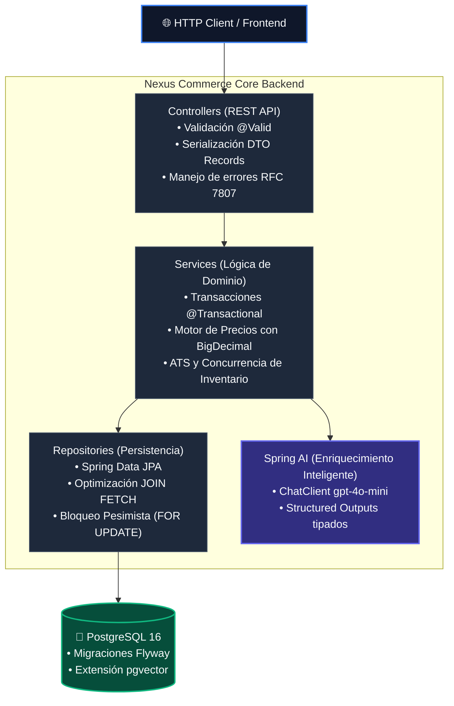

# Nexus Commerce Core

Backend transaccional de alto rendimiento para retail global, diseñado bajo estándares de ingeniería de producción inspirados en plataformas de comercio electrónico de escala masiva.


---

## 1. Arquitectura y Principios de Diseño

El sistema aplica separación estricta de responsabilidades (*Separation of Concerns*) y desacoplamiento de capas:



### Directrices Técnicas Obligatorias
* **Inmutabilidad y DTOs:** Las entidades JPA nunca se exponen al exterior. La comunicación con clientes HTTP se realiza mediante Java `Record` inmutables.
* **Aritmética Financiera:** Tolerancia cero con errores de coma flotante. Todos los cálculos de precios, divisas e impuestos utilizan estrictamente `BigDecimal` con redondeo `RoundingMode.HALF_UP`.
* **Concurrencia de Inventario:** Prevención de *over-selling* mediante bloqueo pesimista en base de datos (`SELECT ... FOR UPDATE` vía `@Lock(LockModeType.PESSIMISTIC_WRITE)`).
* **Manejo de Errores Semántico:** Excepciones de dominio traducidas centralizadamente por `GlobalExceptionHandler` bajo el estándar de errores estructurados (HTTP 400, 404, 409 Conflict).
* **Taxonomía Automatizada:** Integración de **Spring AI** para enriquecer descripciones textiles no estructuradas mediante *Structured Outputs* (JSON Schema estricto).
* **Trazabilidad de Decisiones:** Los fundamentos técnicos y compromisos arquitectónicos están documentados en [docs/adr](docs/adr/README.md).

---

## 2. Motores Implementados

| Módulo | Responsabilidad de Negocio | Enfoque Técnico |
| :--- | :--- | :--- |
| **Catalog Engine** | Gestión jerárquica de Producto y variantes físicas (SKU). | Carga sin problema N+1 (`@EntityGraph`), consultas JPQL optimizadas. |
| **Pricing Engine** | Precios multidivisa por mercado con desglose impositivo. | Modelado desacoplado por mercado (`MarketPrice`), cálculo dinámico de base neta e IVA. |
| **Inventory Engine** | Visión omnicanal de existencias y control de reservas atómicas. | Cálculo ATS (*Available to Sell*), bloqueo pesimista contra condiciones de carrera. |
| **AI Enrichment** | Extracción automática de taxonomía, ocasión y tags de búsqueda. | Spring AI `ChatClient` con `gpt-4o-mini`, deserialización a record tipado. |

---

## 3. Catálogo de APIs REST

### Catálogo de Productos
* `GET /api/v1/products` $\rightarrow$ Lista todos los productos y sus variantes SKU.
* `GET /api/v1/products/search?reference={ref}` $\rightarrow$ Búsqueda exacta por código comercial (ej: `0432/021`).
* `POST /api/v1/products/enrich?reference={ref}` $\rightarrow$ Clasificación y enriquecimiento taxonómico mediante LLM.

### Precios Multimercado
* `GET /api/v1/pricing/skus/{skuId}?market={code}` $\rightarrow$ Devuelve desglose financiero (base neta, IVA, moneda y descuento). Mercado por defecto: `ES`.

### Inventario y Stock
* `GET /api/v1/inventory/skus/{skuId}` $\rightarrow$ Consulta agregada del stock omnicanal y desglose por almacén.
* `POST /api/v1/inventory/reserve` $\rightarrow$ Reserva atómica de existencias. Devuelve `409 Conflict` si el ATS es insuficiente.

---

## 4. Puesta en Marcha Local

### Prerrequisitos
* Java 21 LTS (ej: Amazon Corretto / Eclipse Temurin)
* Docker Desktop u OrbStack
* Puerto `5432` y `8080` disponibles

### 1. Iniciar Base de Datos
```bash
docker compose up -d
```

### 2. Ejecutar la Suite de Pruebas (>90% Cobertura)
```bash
cd backend
./mvnw clean test
```

### 3. Arrancar la Aplicación
```bash
cd backend
./mvnw spring-boot:run
```
La aplicación iniciará en `http://localhost:8080`. Flyway ejecutará automáticamente las migraciones pendientes en `src/main/resources/db/migration`.